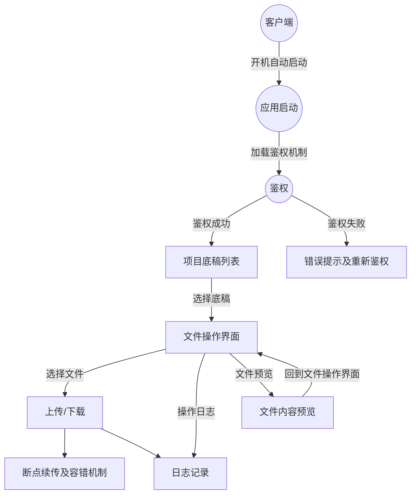
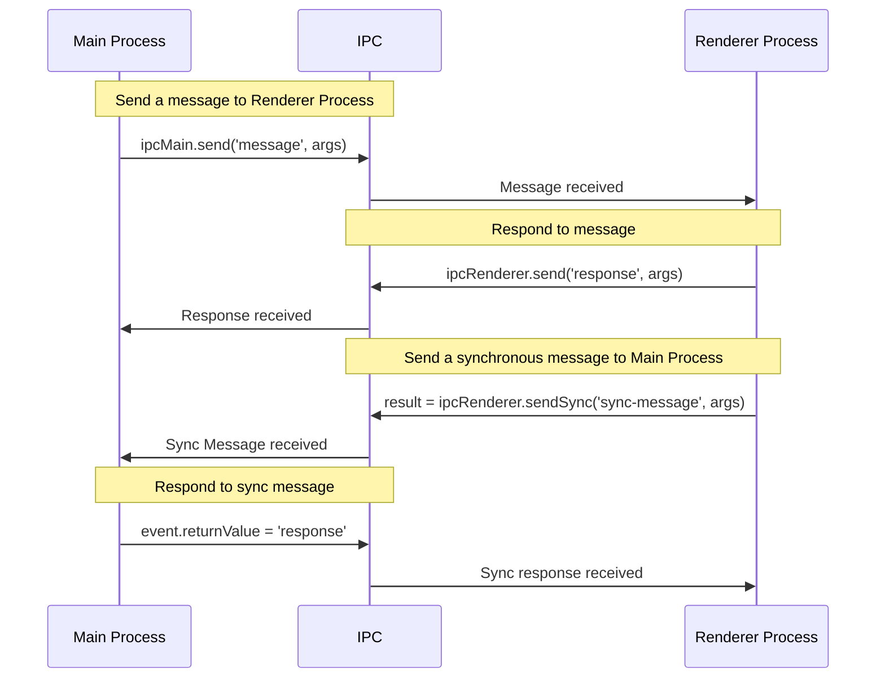
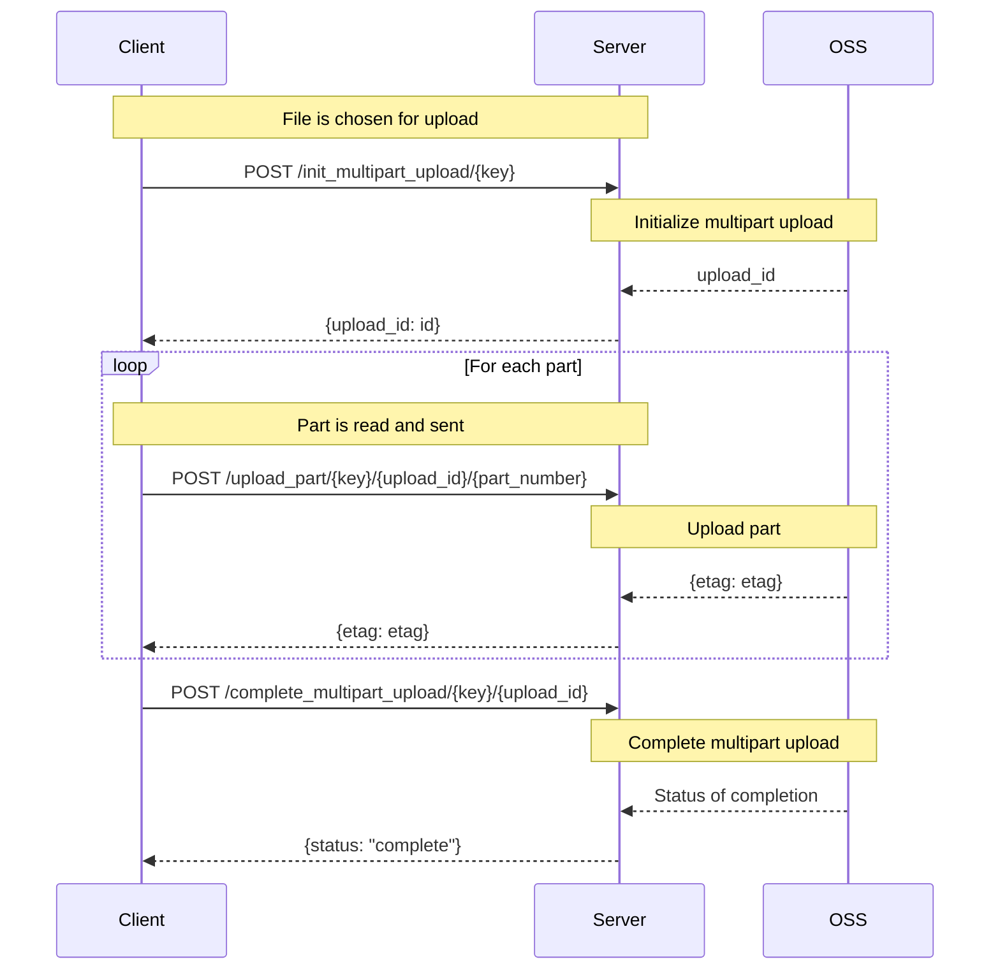

# Electron底稿系统

底稿文件上传下载的客户端，客户端打算使用electron进行开发，希望实现如下功能，我应该怎么做： 

1. 可以上传文件夹及大文件 
2. 支持开机自动启动 
3. 支持断点续传 
4. 上传下载容错机制，不能被一个报错的文件卡住后续所有同步
5. 客户端操作日志 
6. 客户端可预览底稿文件内容 
7. 完整的鉴权机制

>要实现这个项目，需要应对不同的挑战和功能需求。以下是实现这些功能的一些建议：
>
>1. **可以上传文件夹及大文件：** Electron 提供了很多 Node.js 的 API，所以可以使用 `fs` 模块来读取文件夹和文件。上传大文件时，可能需要把文件分割成多个部分（或称为"块"），并且可能需要一个服务器来接收和重新组装这些块。
>
>2. **支持开机自动启动：** 可以使用 `electron-packager` 或 `electron-builder` 这样的工具为应用创建一个安装器，这将允许的应用在系统启动时自动运行。另外，可以使用 `auto-launch` 库来实现这个功能。
>
>3. **支持断点续传：** 把大文件分割成多个部分进行上传时，可以记住已经上传了哪些部分，然后在网络连接中断后，从最后一个成功上传的部分开始重新上传。可以在客户端和服务器都保持一个上传进度的记录，以便在需要时恢复上传。
>
>4. **上传下载容错机制：** 为了避免一个错误的文件阻止后续文件的上传或下载，可以使用 Promise 的 `allSettled` 方法，它可以等待所有的 Promise 完成（无论是完成还是失败）。这样，可以同时处理所有的上传或下载，即使其中一些出现错误。
>
>5. **客户端操作日志：** 可以使用像 `winston` 这样的日志库来记录客户端的所有操作。这些日志可以用于调试或跟踪用户的行为。
>
>6. **客户端可预览底稿文件内容：** 对于文本文件，可以直接在 Electron 应用中打开它们。对于其他类型的文件，可能需要使用适当的库或 API 来预览它们。
>
>7. **完整的鉴权机制：** 可以使用 OAuth 或 JWT 等协议来实现鉴权。这通常涉及到向用户展示一个登录窗口，然后将他们重定向到一个授权服务器。一旦用户登录并授权的应用，就可以获取到一个令牌，然后可以使用这个令牌来验证用户的身份和访问权限。
>



---


## 开发步骤

1. **搭建项目框架**：首先使用 Electron 快速开始模板或者一个类似于electron-forge或electron-builder的项目脚手架工具来创建项目。

2. **页面展示项目底稿列表：** 项目底稿列表支持筛选，选择项目底稿后，可进行上传/下载操作

3. **可以上传文件夹及大文件：** Electron 提供了很多 Node.js 的 API，所以可以使用 `fs` 模块来读取文件夹和文件。上传大文件时，可能需要把文件分割成多个部分（或称为"块"），并且可能需要一个服务器来接收和重新组装这些块。

4. **断点续传：** 把大文件分割成多个部分进行上传时，可以记住已经上传了哪些部分，然后在网络连接中断后，从最后一个成功上传的部分开始重新上传。可以在客户端和服务器都保持一个上传进度的记录，以便在需要时恢复上传。

5. **上传下载容错机制：** 为了避免一个错误的文件阻止后续文件的上传或下载，可以使用 Promise 的 `allSettled` 方法，等待所有的 Promise 完成（无论是完成还是失败）。这样，可以同时处理所有的上传或下载。

6. **开机自动启动：** 可以用 `electron-packager` 或 `electron-builder` 这样的工具为应用创建一个安装器，实现应用在系统启动时自动运行。或者使用 `auto-launch` 库来实现这个功能。

7. **客户端操作日志：** 可以用像 `winston`或`electron-log`或`log4js-node`这样的日志库来记录客户端的所有操作。日志可以用于调试或跟踪用户的行为。

8. **客户端可预览底稿文件内容：** 对于文本文件，可以直接在 Electron 应用中打开。对于其他类型的文件，可能需要使用适当的库或 API 来预览。或者直接打开底稿预览的tab页

9. **完整的鉴权机制：** 可以用 OAuth 或 JWT 等协议来实现鉴权。用户登录并授权后可以获取到一个令牌，然后可以用这个令牌来验证用户的身份和访问权限。权限管理，可以在服务器端进行控制，只对具有相应权限的用户提供服务。

   1. 客户端和web端同步登录，网页已登录，点击调用客户端，不需要重新登录---待确认
    # Electron登录鉴权+进程间通信

目前认证中心接入了企业微信OAuth认证，

业务平台接入了认证中心的OAuth认证，

Electron作为独立应用，为了能让用户通过企业微信扫码登录，并正确获取业务平台认证(Cookies->SESSION)，做了以下操作:
1. Renderer进程调用业务平台的Checklogin接口: 未授权会经过多次302重定向，最终至认证中心扫码登录页面

2. Main进程监听HeadersReceived事件，捕获认证成功的Cookie(SESSION)，并通过篡改SameSite，允许跨域Ajax请求携带Cookie(SESSION)

   ```js
   session.defaultSession.webRequest.onHeadersReceived((details, callback) => {
         if (!details.responseHeaders) return
         if (details.url.includes('/hermes/login/oauth2/code/hydra?code')) {
           const setCookieHeaders = details.responseHeaders['set-cookie']
           if (setCookieHeaders) {
             const updatedSetCookieHeaders = setCookieHeaders.map((header) => {
               if (header.toLowerCase().includes('samesite')) {
                 // 如果已有SameSite属性，替换为SameSite=None
                 return header.replace(/SameSite=\w+;/i, 'SameSite=None;')
               }
               // 如果没有SameSite属性，添加SameSite=None
               return `${header}; SameSite=None`
             })
             details.responseHeaders['set-cookie'] = updatedSetCookieHeaders
           }
         }
         callback({ cancel: false, responseHeaders: details.responseHeaders })
       })
   ```

3. 允许Ajax跨域携带Cookie后，未来所有发往业务平台API的请求都会携带对应Cookie.


## Electron进程间通信模型

在 Electron 中，有两种进程：主进程 (Main Process) 和渲染器进程 (Renderer Process)。主进程负责运行 package.json 的 main 脚本并创建应用窗口，渲染器进程则用于运行用户界面的 JavaScript。这两种进程之间的通信主要依赖 Electron 的 IPC (Inter Process Communication) 模块。

以下是一个 Mermaid 流程图，描述 Electron 中的主进程和渲染器进程之间的 IPC 通信：



在这个流程中：

1. 主进程通过 IPC 的 ipcMain.send 方法发送一条消息到渲染器进程。
2. 渲染器进程收到消息，并通过 IPC 的 ipcRenderer.send 方法发送回复。
3. 渲染器进程也可以发送同步消息给主进程，通过 IPC 的 ipcRenderer.sendSync 方法。
4. 主进程收到同步消息，并通过修改 event 的 returnValue 属性来同步回复。

请注意，由于 Electron 本身的架构，同步 IPC 消息可能会阻塞主进程，因此应该尽量避免使用。

10. **测试**：在开发过程中，需要进行单元测试和集成测试。可以使用` Mocha, Chai, Jest`等工具进行测试。

11. **打包与发布**：最后，可以用 `electron-builder `或 `electron-packager` 等工具将应用打包成各种平台（Windows、macOS、Linux）的应用，然后进行发布。

    1. 安装包图标：准备一张png图作为安装包图标。不同操作系统所需图标格式不同，Mac对应格式为icns，windows对应图标格式为ico。图标的生成可借助`electron-icon-builder`

12. **自动更新：**每次打开应用时，进行自动检测，根据当前应用的version和线上版本进行匹配，有新的version，就自动下载，下载完成询问用户是否安装新版本。检测更新可借助`electron-updater`实现

    ```mermaid
    graph TD
        A((应用启动)) --> B[检查更新]
        B --> |YES| C[下载新安装包]
        B --> |No| F
        C[下载新安装包] -->|下载完成| D[询问用户]
    	D --> |同意更新| E[安装更新]
    	D --> |不同意更新| F[安装更新]
    	E --> F((结束))
    
    ```

    


## 断线续传
分片上传逻辑：


这个流程图的基本逻辑如下：

1. 客户端(Client)选择一个文件上传，并向服务器(Server)发送初始化多部分上传的请求。

2. 服务器在OSS上初始化多部分上传，OSS返回一个upload_id。

3. 服务器将upload_id返回给客户端。

4. 客户端开始逐个读取文件的每一部分，并向服务器发送每一部分的数据。

5. 服务器将每一部分的数据上传到OSS，OSS返回一个etag。

6. 服务器将etag返回给客户端。

7. 客户端在所有部分都上传完成后，向服务器发送完成多部分上传的请求。

8. 服务器在OSS上完成多部分上传，OSS返回完成的状态。

9. 服务器将完成的状态返回给客户端。

阿里云对象存储分片上传设计:


## 其他：

云盘：

有客户端，直接上传

1. 客户端上传文件夹
   1. 文件快传的逻辑，想要做的功能
2. 整套下载底稿文件，
                   1. 下载前需要做检查，电脑中可能存在多个客户端，选中的下载目录是否被分享到了其他网盘客户端
            
3. 对外报送的下载
4. 对文件目录的处理
   1. 按顺序编号1-1，机器模型
5. 页面展示项目列表，点进去后可以显示
6. 底稿上传页面，多级匹配上传，点击本地上传，唤起本地上传的electron客户端
7. 客户端的操作日志
8. 客户端直接预览底稿文件内容，可直接打开tab页（考虑鉴权）
9. 底稿上传下载拆一个单独的域名
10. 流程的底稿如何下载的问题，流程发起的时候会把当前底稿文件做一个快照？？？？（暂不考虑）
11. 项目底稿和流程中的底稿文件


在线预览

1. 文件树的优化

---

网盘
基础功能

正常情况，同一个文件（相同哈希值），底层只存一份
网盘删除文件不做真的删除，仅修改数据库记录，秒级完成
文件复制、移动，秒级完成
网盘单个用户支持大量文件，总大小可以支持到 1T 以上
协同编辑，在线预览/编辑 Word Excel powerpoint pdf image
版本管理，能够记录历史版本，支持快速恢复、冲突解决
文件名长度限制、文件总路径长度限制、单个文件大小限制
共享、复制、删除、恢复，同一个文件底层只存一份
对接已有的 s3 协议存储
离职成员文件转移
支持公开链接共享（有效期），外部用户输入密码打开，可以上传文件
支持共享给个人、分组，二次共享权限限制
文件名搜索
确认多版本逻辑，是否可以配合 s3 的多版本机制
操作日志量太大怎么处理
生产环境开发规范只允许 GET POST
提供类似阿里云 OSS 的接口
在线预览、在线编辑文档功能提供给其他系统使用
增强功能

文件内容搜索
sm3 hash 计算
文件增删查的 hook 机制
管理功能

水印
权限控制粒度要细
每个文件的审计日志
管理后台能对每个人的文件做操作，能够恢复全部已删除文件。恢复文件目录不能乱
账号管理
管理员免密码登陆其他用户账号
管理员管理其他用户回收站
文件恢复目录重建，现状是必须先恢复根文件夹，否则会到根目录
回收站便捷恢复功能，现状如果目录下的文件一个一个删除的需要一个一个恢复，能不能按照顶层文件夹递归恢复
客户端

网盘同步客户端易用
同步容错机制，不能被一个报错的文件卡住后续所有同步
客户端（web、native）支持断点续传
大量文件删除时需要手动确认，经常有同事不理解网盘自动同步的逻辑，会误删除
第三方系统复用
第三方集成

暴露底层 API，可作为其他系统存储依赖
集成第三方文档比对，智能文本审核等工具
集成 ad、oauth 登陆
其他系统产生的文件如何管理
底稿打包下载的需求
系统迁移

迁移工具
网盘与底稿
底稿与网盘重复文件较多，底层统一设计，放在一个数据存储服务上，同一个文件不重复存储
底稿与网盘交互，底稿支持从网盘选择文件同步，秒级完成
支持长目录名称，超过 200 个字符
客户端给底稿上传使用
解决方案
巴别鸟 http://www.babel.cc
亿方云 https://www.fangcloud.com
按用户数收费，1000 个用户 30 万起
外部用户数量限制？
病毒库
单账号用户数据大
够快 https://www.gokuai.com
燕麦云 https://www.oatos.com
按用户数收费，1000 个用户 24 万起


## Electron生态开发技术选型

### 脚手架选型

官方提供的有[Electron Forge](https://link.juejin.cn/?target=https%3A%2F%2Fwww.electronforge.io%2F)，[Electron Fiddle](https://link.juejin.cn/?target=https%3A%2F%2Fwww.electronjs.org%2Fes%2Ffiddle)，[electron-quick-start](https://link.juejin.cn/?target=https%3A%2F%2Fgithub.com%2Felectron%2Felectron-quick-start)，如果应用不复杂，可以用官方的脚手架生成一个快速上手的模板，直接进行开发。

还有一些开源的脚手架，比如[electron-vue](https://github.com/SimulatedGREG/electron-vue)或[electron-react-boilerplate](https://github.com/electron-react-boilerplate/electron-react-boilerplate)或[electron-vite-vue](https://github.com/electron-vite/electron-vite-vue)之类的，也可以快速的生成一个固定的模版，然后往里面填充你的内容。

下面是 Electron React Boilerplate 和 Electron Vue 这两个项目的对比表格：

| 功能/特性          | Electron React Boilerplate           | Electron Vue                                                 | electron-vite-vue                                            |
| ------------------ | ------------------------------------ | :----------------------------------------------------------- | ------------------------------------------------------------ |
| Github Stars       | 21.6K                                | 15.4k                                                        | 2.8k                                                         |
| 架构               | 基于Electron^25.0.1， React 和 Redux | 基于Electron^2.0.4， Vue 和 Vuex，**Electron版本过低**       | 基于Electron^25.0.1， Vue3 和 Vite                           |
| 开发语言           | TypeScript                           | JavaScript/TypeScript                                        | TypeScript                                                   |
| 支持热重载         | 是                                   | 是                                                           | 是                                                           |
| 支持调试工具       | 是                                   | 是                                                           | 是                                                           |
| 文件结构和组织     | 目录结构清晰，易于组织和扩展         | 目录结构清晰，易于组织和扩展                                 | 目录结构清晰，易于组织和扩展                                 |
| 状态管理           | 使用 Redux 进行状态管理              | 使用 Vuex 进行状态管理                                       |                                                              |
| 路由               | react-router-dom                     | vue-router                                                   |                                                              |
| UI 组件库          | 可根据需要选择任何 React UI 组件库   | 可根据需要选择任何 Vue UI 组件库                             | 可根据需要选择任何 Vue UI 组件库                             |
| 构建工具和配置     | Webpack 构建，提供了一些默认的配置   | Webpack 构建，提供了一些默认的配置                           | 使用vite进行构建，提供了一些默认配置；<br>[vite的构建速度整体比webpack要快](https://cn.vitejs.dev/guide/why.html) |
| 可维护性           | 代码结构清晰，易于理解和维护         | 代码结构清晰，易于理解和维护                                 | 代码结构清晰，易于理解和维护                                 |
| 文档               | 完善的文档，提供了丰富的示例和教程   | 文档相对较少，但有一些基本的示例和教程                       | 文档相对较少，但有一些基本的示例和教程                       |
| 社区活动和更新频率 | 活跃的社区，更新频率较高             | **更新频率较低，看起来不再维护了**。看issue里有些新的electron+vite+vue的模板项目可参考 | 社区活跃度一般，更新频率较高                                 |
| 打包工具           | electron-builder                     | electron-builder/electron-packager                           | electron-builder                                             |
| 自动更新           | electron-updater                     |                                                              |                                                              |
| 日志系统           | electron-log                         |                                                              |                                                              |
| 测试               | jest                                 | chai，mocha可选                                              |                                                              |
| 编码风格           | eslint+prettier                      | eslint 可选                                                  |                                                              |

当前选择在electron-vite-vue模板基础上搭配以下工具：

UI组件库：[element-plus](https://element-plus.org/zh-CN/#/zh-CN)

状态管理：[pinia](https://pinia.vuejs.org/introduction.html)

路由：[vue-router](https://router.vuejs.org/zh/guide/)

http: [axios](https://axios-http.com/docs/intro)

构建工具：vite

日志系统：electron-log 

应用检测更新：electron-updater

代码格式化工具：prettier

总体体验下来感觉，比起直接使用模板要慢一些


个人感觉第一个模板会更合适一些

综合考虑选择了Electron React Boilerplate

### Electron React Boilerplate

#### package.json文件分析：

```json
{
  "main": "./src/main/main.ts", // 应用程序的入口点，先执行这个入口文件
  "scripts": {
    "build": "concurrently \"npm run build:main\" \"npm run build:renderer\"", // 同时运行build:main 和 build:renderer
    "build:main": "cross-env NODE_ENV=production TS_NODE_TRANSPILE_ONLY=true webpack --config ./.erb/configs/webpack.config.main.prod.ts", // 设置环境变量 NODE_ENV 为 production，并使用 webpack 和指定的配置文件构建主进程代码
    "build:renderer": "cross-env NODE_ENV=production TS_NODE_TRANSPILE_ONLY=true webpack --config ./.erb/configs/webpack.config.renderer.prod.ts",
    "postinstall": "ts-node .erb/scripts/check-native-dep.js && electron-builder install-app-deps && cross-env NODE_ENV=development TS_NODE_TRANSPILE_ONLY=true webpack --config ./.erb/configs/webpack.config.renderer.dev.dll.ts", // 在 npm install 后运行，进行一些后置操作，包括检查本地依赖、安装 electron-builder 的应用依赖、并构建开发环境的 renderer。
    "lint": "cross-env NODE_ENV=development eslint . --ext .js,.jsx,.ts,.tsx",
    "package": "ts-node ./.erb/scripts/clean.js dist && npm run build && electron-builder build --publish never", //先清理 dist 目录，然后构建应用，最后使用 electron-builder 打包应用
    "rebuild": "electron-rebuild --parallel --types prod,dev,optional --module-dir release/app", // 重建 Electron 的本地依赖
    "start": "ts-node ./.erb/scripts/check-port-in-use.js && npm run start:renderer", // 先检查端口是否被占用，然后启动渲染进程
    "start:main": "cross-env NODE_ENV=development electronmon -r ts-node/register/transpile-only .", // 在开发环境下启动主进程
    "start:preload": "cross-env NODE_ENV=development TS_NODE_TRANSPILE_ONLY=true webpack --config ./.erb/configs/webpack.config.preload.dev.ts", // 在开发环境下构建预加载脚本
    "start:renderer": "cross-env NODE_ENV=development TS_NODE_TRANSPILE_ONLY=true webpack serve --config ./.erb/configs/webpack.config.renderer.dev.ts", // 在开发环境下启动 webpack 开发服务器并运行渲染进程
    "test": "jest"
  },
  "browserslist": [], // 配置不同的前端工具支持的浏览器版本范围
  "prettier": { // 设置Prettier代码格式化工具
    "singleQuote": true,
    "overrides": [
      {
        "files": [ // 应用以下配置选项的文件列表
          ".prettierrc",
          ".eslintrc"
        ],
        "options": {
          "parser": "json"
        }
      }
    ]
  },
  "jest": {
    "moduleDirectories": [
      "node_modules",
      "release/app/node_modules",
      "src"
    ],
    "moduleFileExtensions": [
      "js",
      "jsx",
      "ts",
      "tsx",
      "json"
    ],
    "moduleNameMapper": {
      "\\.(jpg|jpeg|png|gif|eot|otf|webp|svg|ttf|woff|woff2|mp4|webm|wav|mp3|m4a|aac|oga)$": "<rootDir>/.erb/mocks/fileMock.js",
      "\\.(css|less|sass|scss)$": "identity-obj-proxy"
    },
    "setupFiles": [
      "./.erb/scripts/check-build-exists.ts"
    ],
    "testEnvironment": "jsdom",
    "testEnvironmentOptions": {
      "url": "http://localhost/"
    },
    "testPathIgnorePatterns": [
      "release/app/dist",
      ".erb/dll"
    ],
    "transform": {
      "\\.(ts|tsx|js|jsx)$": "ts-jest"
    }
  },
  "dependencies": {
    "electron-debug": "^3.2.0", // 调试功能
    "electron-log": "^4.4.8", // 日志系统
    "electron-updater": "^5.3.0", //自动更新,用于从发布服务器下载和安装应用更新
    "react": "^18.2.0",
    "react-dom": "^18.2.0",
    "react-router-dom": "^6.11.2" // React Router的Web版本，用于在React应用中实现动态路由。
  },
  "devDependencies": {
    "@electron/notarize": "^1.2.3",
    "@electron/rebuild": "^3.2.13",
    "@pmmmwh/react-refresh-webpack-plugin": "^0.5.10", // 和react-refresh配套
    "@svgr/webpack": "^8.0.1",
    "@teamsupercell/typings-for-css-modules-loader": "^2.5.2",
    "@testing-library/jest-dom": "^5.16.5",
    "@testing-library/react": "^14.0.0",
    "@types/jest": "^29.5.2",
    "@types/node": "20.2.5",
    "@types/react": "^18.2.8",
    "@types/react-dom": "^18.2.4",
    "@types/react-test-renderer": "^18.0.0",
    "@types/terser-webpack-plugin": "^5.0.4",
    "@types/webpack-bundle-analyzer": "^4.6.0",
    "@typescript-eslint/eslint-plugin": "^5.59.8",
    "@typescript-eslint/parser": "^5.59.8",
    "browserslist-config-erb": "^0.0.3",
    "chalk": "^4.1.2",
    "concurrently": "^8.1.0", // 连接多个命令，中间使用空格分开
    "core-js": "^3.30.2",
    "cross-env": "^7.0.3", // 配置跨平台的环境变量
    "css-loader": "^6.8.1",
    "css-minimizer-webpack-plugin": "^5.0.0",
    "detect-port": "^1.5.1", // Node.js 包，检测一个网络端口是否被使用
    "electron": "^25.0.1",
    "electron-builder": "^24.2.1",
    "electron-devtools-installer": "^3.2.0",
    "electronmon": "^2.0.2", // 监视源代码文件的变化并自动重启 Electron 应用
    "eslint": "^8.42.0",
    "eslint-config-airbnb-base": "^15.0.0",
    "eslint-config-erb": "^4.0.6", // 是专门为 Electron React Boilerplate 项目创建的 ESLint 配置,包括了一些适合该项目的规则,在项目的 .eslintrc 文件中引用了这个配置{"extends": "erb"}
    "eslint-import-resolver-typescript": "^3.5.5",
    "eslint-import-resolver-webpack": "^0.13.2",
    "eslint-plugin-compat": "^4.1.4",
    "eslint-plugin-import": "^2.27.5",
    "eslint-plugin-jest": "^27.2.1",
    "eslint-plugin-jsx-a11y": "^6.7.1",
    "eslint-plugin-promise": "^6.1.1",
    "eslint-plugin-react": "^7.32.2",
    "eslint-plugin-react-hooks": "^4.6.0",
    "file-loader": "^6.2.0",
    "html-webpack-plugin": "^5.5.1",
    "identity-obj-proxy": "^3.0.0", // 在 JavaScript 或 TypeScript 测试中模拟模块导入的工具。它主要用于测试像 CSS Module 这样的模块。
    "jest": "^29.5.0",
    "jest-environment-jsdom": "^29.5.0",
    "mini-css-extract-plugin": "^2.7.6",
    "prettier": "^2.8.8",
    "react-refresh": "^0.14.0", //  用于在开发环境中实现 React 组件的热更新
    "react-test-renderer": "^18.2.0",
    "rimraf": "^5.0.1",
    "sass": "^1.62.1",
    "sass-loader": "^13.3.1",
    "style-loader": "^3.3.3",
    "terser-webpack-plugin": "^5.3.9",
    "ts-jest": "^29.1.0",
    "ts-loader": "^9.4.3",
    "ts-node": "^10.9.1",
    "tsconfig-paths-webpack-plugin": "^4.0.1",
    "typescript": "^5.1.3",
    "url-loader": "^4.1.1",
    "webpack": "^5.85.0",
    "webpack-bundle-analyzer": "^4.9.0",
    "webpack-cli": "^5.1.1",
    "webpack-dev-server": "^4.15.0",
    "webpack-merge": "^5.9.0"
  },
  "build": { // electron-builder配置，应用打包的配置
    "productName": "GjthrdApp", // 应用的显示名称
    "appId": "org.erb.ElectronReact",
    "asar": true, //打包应用的格式是否为asar，类似 TAR 的归档格式
    "asarUnpack": "**\\*.{node,dll}", //配置哪些文件不应该被 ASAR 归档，而应该在应用中单独存在。这里设置的是所有后缀为 .node 或 .dll 的文件。
    "files": [ // 配置哪些文件或目录应该被包含在打包后的应用中。
      "dist",
      "node_modules",
      "package.json"
    ],
    "afterSign": ".erb/scripts/notarize.js", // 指定签名完成后执行的脚本
    "mac": {
      "target": {
        "target": "default",
        "arch": [
          "arm64",
          "x64"
        ]
      },
      "type": "distribution", //macOS打包类型。default：默认的打包类型；distribution：生成一个包含所有相关文件的DMG映像文件；dir：把应用打包成一个目录，不生成任何可执行文件或者映像文件，调试或测试可用
      "hardenedRuntime": true, // 是否启用 macOS 的强化运行时。强化运行时可以为应用提供一些额外的系统级保护。
      "entitlements": "assets/entitlements.mac.plist", //指定应用的权限列表文件，这些文件定义了应用在 macOS 上可以使用的功能和权限。
      "entitlementsInherit": "assets/entitlements.mac.plist", // 指定应用的权限列表文件
      "gatekeeperAssess": false // 是否跳过 Gatekeeper 的安全检查
    },
    "dmg": { // 指定 .dmg 安装界面中的图标位置，以下配置中，有两个图标，一个在 (130, 220) 位置，另一个在 (410, 220) 位置，并且这个图标是一个链接，点击会打开 "/Applications" 文件夹。
      "contents": [
        {
          "x": 130,
          "y": 220
        },
        {
          "x": 410, // 位置坐标
          "y": 220,
          "type": "link", // 图标类型
          "path": "/Applications" // 链接路径
        }
      ]
    },
    "win": {
      "target": [ // 打包格式
        "nsis" // "nsis" 是一种常用的安装包格式，表示使用 NSIS (Nullsoft Scriptable Install System) 来创建 Windows 安装包。
      ]
    },
    "linux": {
      "target": [
        "AppImage" // "AppImage" 是一种常用的 Linux 分发格式，可以在各种发行版上运行
      ],
      "category": "Development" // 应用的分类。"Development"：开发工具
    },
    "directories": { // 定义了构建过程中需要用到的一些重要目录
      "app": "release/app", // 源代码的位置, electron-builder 会在这个目录下寻找源代码并进行打包。
      "buildResources": "assets", // 构建资源的位置。这些资源包括图标、脚本、自定义的文件等等。
      "output": "release/build" // 生成的可执行文件放置位置
    },
    "extraResources": [ // 额外的资源文件或文件夹, 这些资源会在构建过程中被复制到资源目录
      "./assets/**" // 所有在 assets 目录下的文件和文件夹都会被复制。
    ],
    "publish": { // 定义了构建后的应用如何发布
      "provider": "github", // 指定的发布提供商, 设置为 "github" 表示应用会被发布到 GitHub 上。
      "owner": "electron-react-boilerplate", // 指定了 GitHub 仓库的所有者
      "repo": "electron-react-boilerplate" // 指定了 GitHub 仓库的名称
    }
  },
  "devEngines": { // 开发这个项目所需的 node 和 npm 版本, 为了确保开发环境的一致性和项目的稳定
    "node": ">=14.x", // Node.js 的版本至少要求 14.x
    "npm": ">=7.x" //  npm 的版本至少要求 7.x。
  },
  "electronmon": { // electronmon会监视源代码文件的变化并自动重启 Electron 应用
    "patterns": [ // 配置需要监听的文件或目录
      "!**/**", // 默认不监听任何文件或目录
      "src/main/**" // 只监听 src/main 目录下的所有文件和子目录
    ],
    "logLevel": "quiet" // 设置日志的输出级别, "quiet"，表示仅在发生错误时输出日志
  }
}

```


#### 项目结构介绍

```bash

```


## electron-vite-vue3踩坑记

### 安装包安装后，页面白屏

解决方案：打开`开发者工具`，看页面报错信息。本次页面白屏原因是没有在dist-electron下找到index.html文件

在安装包里可以找到C:\Users\luoli\AppData\Local\Programs\gjthrd-app\resources\app.asar文件，这个文件是electron打包后的资源文件夹，

1. 可以通过全局安装asar包，进行解压操作

```bash
npm install -g asar --registry=https://registry.npm.taobao.org
```

2. 进入到当前asar包所在文件夹，进行解压操作：

```bash
asar extract app.asar ./app #解压到当前app文件夹下
```

3. 解压后，文件目录为:

```bash
Mode                 LastWriteTime         Length Name
----                 -------------         ------ ----
d-----         2023/7/12     15:59                dist
d-----         2023/7/12     15:59                node_modules
-a----         2023/7/12     15:59            494 package.json


------------dist目录
Mode                 LastWriteTime         Length Name
----                 -------------         ------ ----
d-----         2023/7/12     15:59                assets
d-----         2023/7/12     15:59                main
d-----         2023/7/12     15:59                preload
-a----         2023/7/12     15:59          23587 haha.jpg
-a----         2023/7/12     15:59            505 index.html

```

4. 修改打包时候的配置文件，file由原来的dist-electron为dist


## electron一键生成项目图标

1. 安装electron-icon-builder

   ```bash
   npm install -g electron-icon-builder // 全局安装
   ```

   ```bash
   npm install --save-dev electron-icon-builder // 本地安装
   ```

   安装较慢，建议使用taobao镜像源

   ```bash
   npm install --save-dev electron-icon-builder --registry=https://registry.npm.taobao.org 
   ```

2. 使用

   ```bash
   electron-icon-builder --input=./public/file.png --output=./public/icons --flatten // 全局使用
   // 把public下的file文件，生成图标，存在public下的icons文件夹下
   // --flatten参数，输出结构扁平化
   ```

   ```bash
   ./node_modules/.bin/electron-icon-builder --input=./public/file.png --output=./public/icons // 本地使用
   ```

3. 输出目录结构，非扁平化：

   ```bash
   [output dir]
       -[icons]
           -[mac]
               - icon.icns
           -[png]
               - 16x16.png
               - 24x24.png
               ...
               ...
               - 512x512.png
               - 1024x1024.png
           -[win]
               -icon.ico
   ```

   扁平化：

   ```bash
   [output dir]
       -[icons]
           - icon.icns
           - icon.ico
           - 16x16.png
           - 24x24.png
           ...
           ...
           - 512x512.png
           - 1024x1024.png
   ```

   

